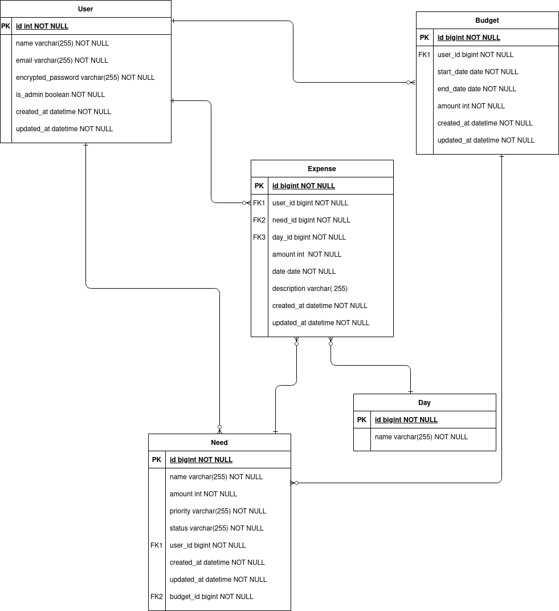
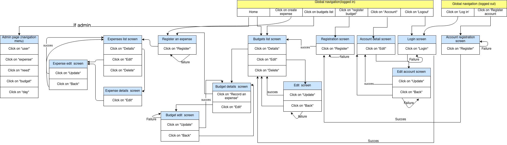

# BudMan

Standing for Budget Manager, this app will help save your money by better managing it.
# Development environment

* ruby 3.0.1
* rails 6.1.4

 # Technology incorporated into this application:

 * AWS EC2
 * devise

# Other technology
* React.js (A front end framework like vue.js)

# How to execute this application

* Clone the repository throught this [link](https://github.com/eaguidigodo/budman.git)
* Run: **bundle install**
* run: **rails db:create**
* run: **rails db:migrate**
* Start your local server: **rails s**

# Catalog design

Follow [this link](https://docs.google.com/spreadsheets/d/10BRN7Nhl36U05Ym3ggUUe_0x8RttGASNtyYde8cBlOo/edit?usp=sharing)

# Table definition document
Follow [this link](https://docs.google.com/spreadsheets/d/10BRN7Nhl36U05Ym3ggUUe_0x8RttGASNtyYde8cBlOo/edit?usp=sharing)

# Wireframe 
Follow [this link](https://drive.google.com/file/d/1pxEHsL8E7sgTmsmLzDBYK0BPV9N0AUkn/view?usp=sharing)

# ER diagram

# Screen Transition diagram
